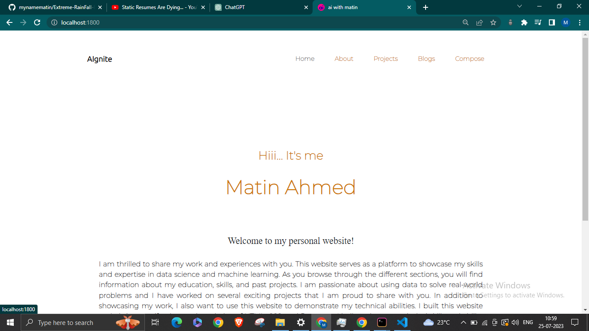
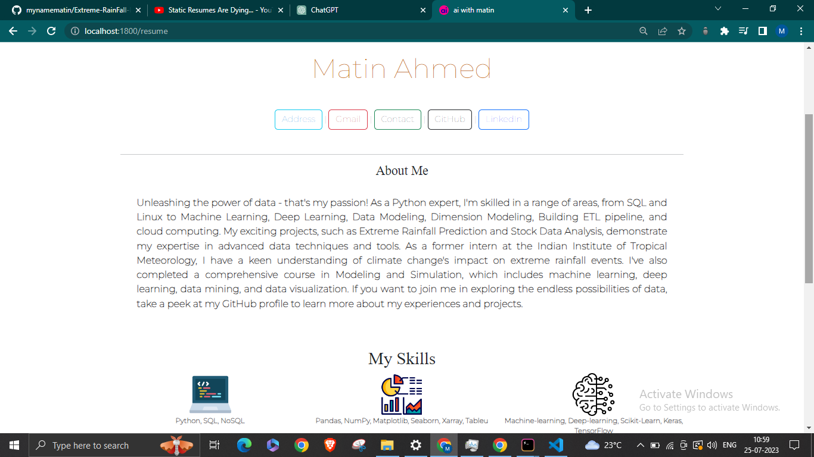
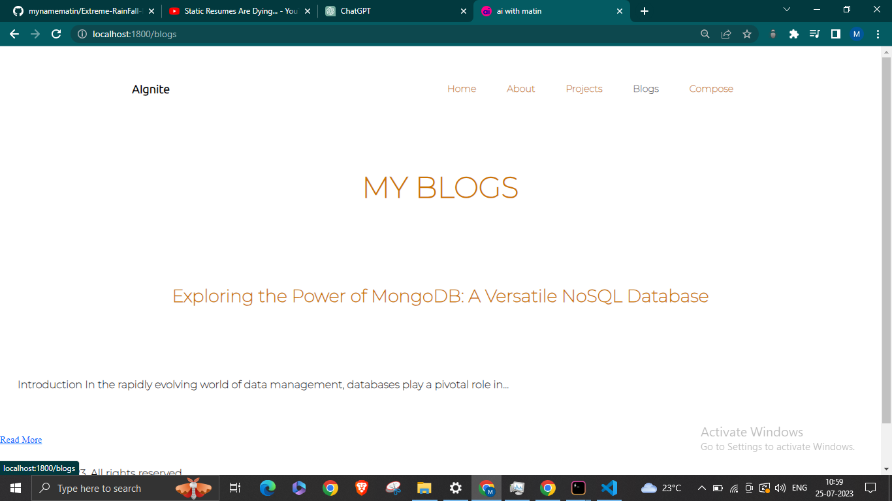
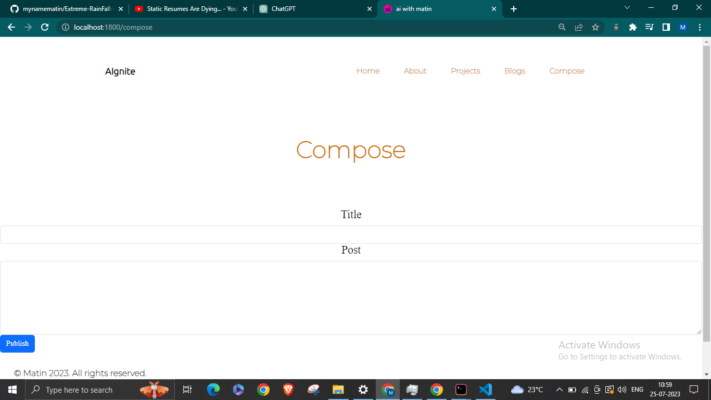

# MyNewWebSpace

MyNewWebSpace is a personal website project built to showcase my skills and experiences in data science and machine learning.

## Table of Contents
- [Description](#description)
- [Features](#features)
- [Screenshots](#screenshots)
- [Installation](#installation)
- [Usage](#usage)
- [Technologies Used](#technologies-used)
- [Contributing](#contributing)
- [License](#license)
- [Contact](#contact)

## Description
The purpose of this project is to create a personal website where I can share my journey, projects, and expertise in the field of data science and machine learning. The website is built using Node.js and Express for the backend, EJS for templating, and MongoDB as the database to store blog posts.

## Features
### Home Page
Provides an introduction to the website and a brief overview of my work and experiences.

### Resume Page
Displays information about my education, skills, and past projects.

### Projects Page
Showcases a list of projects I have worked on.

### Blogs Page
Contains a collection of blog posts where I share insights, tutorials, and thoughts related to data science and machine learning.

### Compose Page
Allows me to create new blog posts through a simple form.

### Individual Blog Post Pages
Each blog post has its own page with a title and content.

## Installation
1. Clone the repository: `git clone https://github.com/mynamematin/MyNewWebSpace.git`
2. Navigate to the project directory: `cd MyNewWebSpace`
3. Install the required dependencies: `npm install express`

## Usage
1. Start the application: `node app.js`
2. Open your web browser and go to `http://localhost:1800`

## Technologies Used
- Node.js
- Express
- EJS (Embedded JavaScript)
- MongoDB
- Bootstrap (for styling)

## Contributing
This project is open for contributions. If you find any issues or have suggestions for improvement, feel free to open an issue or submit a pull request.

## License
_@matinahmed_

## Contact
If you have any questions or want to get in touch, you can reach me at:
- Email: matinahmed000@gmail.com
- GitHub: (https://github.com/mynamematin)
